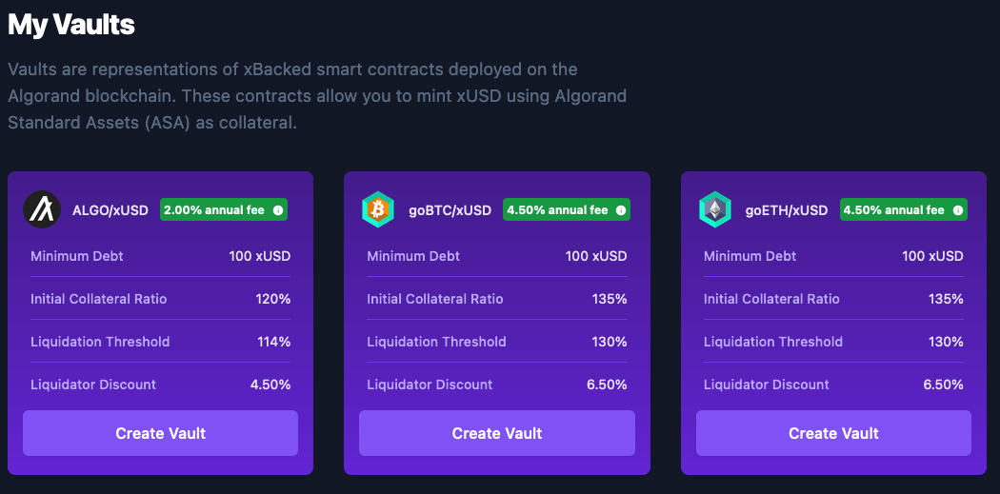

# Product Walkthrough


Video Walkthrough - dated the 7th of February 2022


## Connecting a Wallet

Please [refer to this guide](connecting-wallets.md) on connecting a wallet for xBacked.

Make sure you have Algos in testnet: [https://bank.testnet.algorand.network/](https://bank.testnet.algorand.network)

## Creating a Vault

When you initially open xBacked, you will be presented with this screen

Click on the "Create Vault" button, and you will be presented with a screen that allows you to enter how much collateral you will deposit & how much xUSD to mint.

.png>)

In the next step you will be asked to confirm the vault details before initiating vault creation.

.png>)

Note: on your first time using xBacked you will be prompted with three transactions; one to opt-into the xUSD token, one to opt-into the Vault application, and the third will be to deposit collateral and mint xUSD.

## Using a Vault

When you have created a vault, the main screen will update.

.png>)

Clicking on "View Vault" will show you all the actions you can do with your vault.

.png>)

Each these actions will either improve the health of your vault, or make it worse.

## Closing a Vault

To close a vault, simply return all xUSD + accrued supply fees. After this, the remaining collateral in the vault will be transferred back to you.

.png>)

## Liquidating a Vault

In reality, it is highly likely that a bot will liquidate a vault before you will. However, below is a guide to using the UI

.png>)

Once you fetch vaults, you will be presented with a list of vaults that can be liquidated. Clicking on "Liquidate" will take you to a page where you can repay xUSD & receive discounted collateral for improving the health of the vault

## Redemptions

When xUSD is trading below the $1 target, it becomes profitable to buy it on a DEX and redeem it for $1 of underlying collateral. Choose which collateral to redeem. There is a small fee involved in redemption, taken from the redeemed collateral

